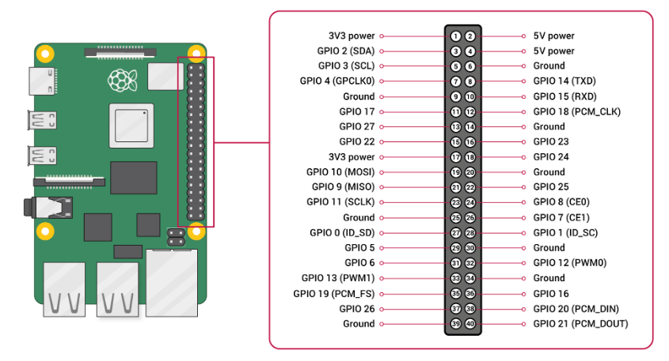

# mavrospy
ROS node to interact with [MAVROS](https://wiki.ros.org/mavros) for basic UAV control.

This current repo is supported on a PX4 flight controller with a RPi4 companion computer running Ubuntu 20.04 MATE with 
ROS Noetic. 

## Usage:

### TODO: TALK ABOUT HOW TO USE CODE

## Setup:

This repository is supported on ROS Noetic. If you haven't already, please install 
[Ubuntu MATE 20.04](https://releases.ubuntu-mate.org/20.04/arm64/) for the RPi4 (arm64) using the 
[Raspberry Pi Imager](https://www.raspberrypi.com/software/). 

Select the `Log in automatically` option upon first boot. 

**Note:** If prompted to upgrade to a newer version of Ubuntu, selected `Don't Upgrade`. ROS Noetic is primarily 
targeted at the Ubuntu 20.04 (Focal) release.

### Wiring

This setup connects the RPi4 to the flight controller's `TELEM2` port, which is generally recommended for offboard 
control.

Connect the flight controller's `TELEM2` `TX`/`RX`/`GND` pins to the complementary `RXD`/`TXD`/`Ground` pins on the RPi4 
GPIO board:

| PX4 TELEM2 Pin | RPi4 GPIO Pin           |
| -------------- | ---------------------- |
| UART5_TX (2)   | RXD (GPIO 15 - pin 10) |
| UART5_RX (3)   | TXD (GPIO 14 - pin 8)  |
| GND (6)        | Ground (pin 6)         |

This diagram shows the RPi4 GPIO board pinout:



The standard `TELEM2` pin assignments are shown below:

| Pins      | Signal          | Voltage |
| --------- |-----------------| ------- |
| 1 (Red)   | VCC (out)       | +5V     |
| 2 (Black) | UART5_TX (out)  | +3.3V   |
| 3 (Black) | UART5_RX (in)   | +3.3V   |
| 4 (Black) | UART5_CTS (out) | +3.3V   |
| 5 (Black) | UART5_RTS (in)  | +3.3V   |
| 6 (Black) | GND             | GND     |

The RPi4 requires a separate 5V/3A power supply via the `5V power` and `Ground` pins. I would recommend soldering a 
battery elimination circuit (BEC) to your UAV's power leads.

### TODO: Diode for uart pin?? or just wait to plug in after full boot

### PX4 Parameters

Assuming you have installed the latest PX4 
[firmware](https://docs.px4.io/main/en/config/firmware.html#install-stable-px4), change the following 
[parameters](https://docs.px4.io/main/en/advanced_config/parameters.html) in QGroundControl:

```
   MAV_1_CONFIG = TELEM2
   UXRCE_DDS_CFG = 0 
   SER_TEL2_BAUD = 57600
```

### Enable UART Communication

Open the firmware boot configuration file:

```
$ sudo nano /boot/firmware/config.txt
```

Append the following text to the end of the file (after the last line):

```
enable_uart=1
dtoverlay=disable-bt
```

Save and exit the file. 

Run this command to add your user to the `dialout` group:

```
$ sudo adduser ${USER} dialout
```

Restart the RPi. 

You can check that the serial port is available by issuing this command: 

```
$ ls /dev/serial0
```

The result of the command should include the RX/TX connection `/dev/serial0`

### Test Connection

[MAVLink](https://mavlink.io/en/) is the default and stable communication interface for working with PX4.


We can test that the RPi and flight controller are communicating with each other via a simple developer MAVLink GCS 
called `mavproxy`.

Install MAVProxy:

```
$ sudo apt install python3-pip
$ sudo pip3 install mavproxy
$ sudo apt remove modemmanager
```

Run MAVProxy, setting the port to connect to `/dev/ttyserial0` and the baud rate to match the flight controller (57600):

```
$ sudo mavproxy.py --master=/dev/serial0 --baudrate 57600
```

MAVProxy on the RPi should now connect to the flight controller via its RX/TX pins. You should be able to see this in the 
RPi terminal. **CTRL+C** to exit.

### Install ROS Noetic

[ROS](http://www.ros.org/) is a general purpose robotics library that can be used with PX4 for drone application 
development.

These instructions are a simplified version of the 
[official installation guide](https://wiki.ros.org/noetic/Installation/Ubuntu).

Set up your computer to accept software from packages.ros.org: 

```
$ sudo sh -c 'echo "deb http://packages.ros.org/ros/ubuntu $(lsb_release -sc) main" > /etc/apt/sources.list.d/ros-latest.list'
```

Set up your keys: 

```
$ sudo apt install curl 
$ curl -s https://raw.githubusercontent.com/ros/rosdistro/master/ros.asc | sudo apt-key add -
```

Make sure your Debian package index is up-to-date:

```
$ sudo apt update
```

Install ROS-Base (Bare Bones):

```
$ sudo apt install ros-noetic-ros-base
```

You must source this script in every bash terminal you use ROS in.

```
$ source /opt/ros/noetic/setup.bash
```

It can be convenient to automatically source this script every time a new shell is launched. These commands will do that 
for you:

```
$ echo "source /opt/ros/noetic/setup.bash" >> ~/.bashrc
$ source ~/.bashrc
```

### Install MAVROS

[MAVROS](https://wiki.ros.org/mavros) is a ROS 1 package that enables MAVLink extendable communication between computers 
running ROS 1 for any MAVLink enabled autopilot, ground station, or peripheral. MAVROS is the "official" supported 
bridge between ROS 1 and the MAVLink protocol.

These instructions are a simplified version of the 
[official installation guide](https://github.com/mavlink/mavros/blob/master/mavros/README.md#installation)

Enter the following command to install MAVROS:

```
$ sudo apt install ros-noetic-mavros ros-noetic-mavros-extras ros-noetic-mavros-msgs
```

Then install [GeographicLib](https://geographiclib.sourceforge.io/) datasets by running the 
`install_geographiclib_datasets.sh` script:

```
$ wget https://raw.githubusercontent.com/mavlink/mavros/master/mavros/scripts/install_geographiclib_datasets.sh
$ sudo bash ./install_geographiclib_datasets.sh
```

### Test MAVROS 

You can test MAVROS is working correctly by issuing the following command:

```
$ roslaunch mavros px4.launch fcu_url:=/dev/serial0:57600
```

This will launch the mavros node and connect to your flight controller. **CTRL+C** to exit.

### Install MAVROSPY

Create a [catkin workspace](https://wiki.ros.org/catkin/workspaces): 

```
$ mkdir -p ~/catkin_ws/src
```

Clone `mavrospy` in your catkin workspace and build with `catkin_make`: 

```
$ sudo apt install git
$ cd ~/catkin_ws/src
$ git clone https://github.com/bandofpv/mavrospy.git
$ cd ..
$ catkin_make
```

Similar with ROS, you must source this script in every bash terminal you use MAVROSPY in.

```
$ source ~/catkin_ws/devel/setup.bash
```

It can be convenient to automatically source this script every time a new shell is launched. These commands will do that 
for you:

```
$ echo "source ~/catkin_ws/devel/setup.bash" >> ~/.bashrc
$ source ~/.bashrc
```

### Test MAVROSPY

### sudo apt install python-is-python3... OR just change shebang /usr/bin/env python3

You can test MAVROSPY is working correctly by issuing the following command: 

```
$ roslaunch mavrospy control_test.launch fcu_url:=/dev/serial0:57600
```

### TODO: write what to expect... note will make breaks after adding mode check

### Start ROS Nodes at Boot

In order to start the mavros node and mavrospy node at boot, we need to create a couple of shell scripts and services. 

Create a separate file that sets your `ROS_MASTER_URI` that we can source when launching ROS Core or any ROS launch:

```
$ sudo mkdir /etc/ros
$ sudo nano /etc/ros/env.sh
```

Put the following lines into the file: 

```
#!/bin/sh
export ROS_MASTER_URI=http://localhost:11311
```

Save and exit the file. 

Create a system service to source all the appropriate environment variables and run ROS core: 

```
$ sudo nano /etc/systemd/system/roscore.service
```

Put the following lines into the file, changing `your_username` to your RPi's username:

```
[Unit]
Description=ROScore service
After=network-online.target

[Service]
Type=forking
User=your_username
ExecStart=/bin/sh -c ". /opt/ros/noetic/setup.sh; . /etc/ros/env.sh; roscore & while ! echo exit | nc localhost 11311 > /dev/null; do sleep 1; done"

[Install]
WantedBy=multi-user.target
```

Save and exit the file.

Create a system service to source all the mavrospy environment variables and run ROS launch: 

```
$ sudo nano /usr/sbin/mavrospy_auto_launch
```

Put the following lines into the file, changing both occurrences of `your_username` to your RPi's username:

```
#!/bin/bash
source $(echo ~your_username)/catkin_ws/devel/setup.bash

source /etc/ros/env.sh

export ROS_HOME=$(echo ~your_username)/.ros

roslaunch mavrospy control_test.launch fcu_url:=/dev/serial0:57600 --wait

exit 125
```

Save and exit the file.

**Note:** : you can modify the launch file to whatever .launch file of your choosing. Example launch files can be found 
in the [launch](https://github.com/bandofpv/mavrospy/tree/main/launch) directory. 

Make the file executable:

```
$ sudo chmod +x /usr/sbin/mavrospy_auto_launch
```

Create a system process to call the shell script above:

```
$ sudo nano /etc/systemd/system/ros_package.service
```

Put the following lines into the file, changing `your_username` to your RPi's username:

```
[Unit]
Requires=roscore.service
After=network-online.target roscore.service

[Service]
Type=simple
User=your_username
ExecStart=/usr/sbin/mavrospy_auto_launch

[Install]
WantedBy=multi-user.target
```

To have the services called on start up we need to make the system aware of the new service files and then enable them.

```
$ sudo systemctl daemon-reload
$ sudo systemctl enable roscore.service ros_package.service
```

Restart the RPi. 

You can verify the services are operational by issuing the following commands:

```
$ sudo systemctl status roscore.service ros_package.service
```

You should see `Active: active (running)` somewhere in the status report for both services. **CTRL+C** to exit.

You're all set! When you boot up our UAV, switch to `ONBOARD` mode and watch it fly!